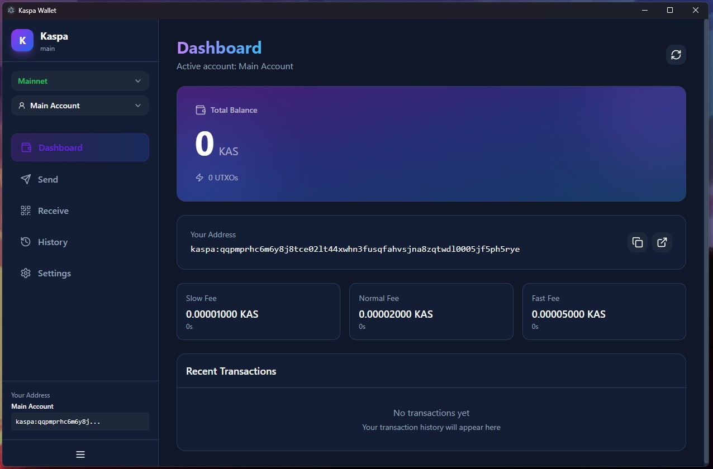

# Kaspa Wallet

A self-custody Kaspa wallet built with React, TypeScript, Vite, and Electron.

This project supports both:
- Browser app (`vite` dev/build)
- Desktop app (`electron` + `electron-builder`)

## Status

Active development. Use carefully and test with small amounts first.

## Screenshot

<p align="center">
  
</p>

## Features

- Multi-wallet vault (create, import, switch, rename, delete)
- Wallet session controls: login, logout, lock, unlock
- Wallet creation flows that show seed phrase before final creation
- Seed backup/reveal in Settings with show/hide toggle
- Multi-account per wallet (create, switch, rename)
- Per-network address book (contacts)
- Network selection (Mainnet, Testnet 10, Testnet 11)
- Send flow with fee presets (`slow`, `normal`, `fast`) and custom fee mode
- Dynamic fee estimation using transaction mass when possible
- Broadcast retry handling for transient RPC/network errors
- Auto-lock inactivity timer with presets and custom minutes
- Electron desktop packaging for Windows (NSIS target configured)

## Security Model

- Wallet vault is encrypted before persistence.
- Encryption uses Web Crypto `AES-GCM` with a key derived via `PBKDF2` (`SHA-256`, `250000` iterations).
- Seed phrases and signing keys stay client-side in this app.
- Wallet data is stored in browser storage (`localStorage`) under encrypted keys.
- When the wallet is unlocked, decrypted vault data exists in app memory for the active session.

Important:
- If you lose your seed phrase, funds cannot be recovered.
- If you lose your password, this app cannot decrypt your stored vault.
- This codebase has no formal security audit published.

## Quick Start

### Prerequisites

- Node.js 20+ recommended
- npm

### Install

```bash
npm install
```

### Install Globally (npm)

After publishing to npm:

```bash
npm install -g @keenhero/kaspa-wallet
kaspa-wallet
```

### Run Web App (Vite)

```bash
npm run dev
```

### Run Desktop App (Electron + Vite)

```bash
npm run dev:desktop
```

### Lint

```bash
npm run lint
```

### Build Web App

```bash
npm run build
```

### Build Desktop App

```bash
npm run build:desktop
```

### Create Desktop Installer

```bash
npm run dist:desktop
```

Installer/output artifacts are generated in `release/`.

### Publish to npm

```bash
npm login
npm publish
```

Notes:
- The package is configured as `@keenhero/kaspa-wallet`.
- `prepack` automatically builds `dist/` before publishing.
- The global command exposed by this package is `kaspa-wallet`.

## Scripts

- `npm run dev`: start Vite dev server
- `npm run dev:renderer`: start renderer on port `5173`
- `npm run dev:electron`: start Electron and connect to dev renderer
- `npm run dev:desktop`: run renderer and Electron together
- `npm run build`: TypeScript build + Vite production build
- `npm run build:desktop`: build renderer + unpacked Electron app
- `npm run dist:desktop`: build renderer + packaged installer
- `npm run start:desktop`: start Electron against built app
- `npm run lint`: run ESLint
- `npm run preview`: preview built web app

## Supported Networks

- Mainnet (`kaspa`, `https://api.kaspa.org`)
- Testnet 10 (`kaspatest`, `https://api-tn10.kaspa.org`)
- Testnet 11 (`kaspatest`, `https://api-tn11.kaspa.org`)

## Project Structure

- `src/pages`: app screens (`Welcome`, `Unlock`, `Dashboard`, `Send`, `Receive`, `History`, `Settings`)
- `src/stores/walletStore.ts`: global wallet state and actions
- `src/lib/wallet.ts`: wallet creation, key derivation, encryption/storage
- `src/lib/kaspa.ts`: Kaspa REST API client and fee helpers
- `src/lib/transaction.ts`: transaction construction/signing helpers
- `electron/main.cjs`: Electron main process window/bootstrap
- `electron/preload.cjs`: safe preload bridge

## Common Issues

- `RPC Server ... WebSocket disconnected`:
  - Usually transient upstream node/API instability.
  - Retry send after a few seconds.

- `fee is under the required amount`:
  - Network required a higher fee than initially selected.
  - Use `normal` or `fast`, or retry and let fee-adjustment logic reattempt.

- `Invalid Kaspa address`:
  - Ensure address prefix matches selected network (`kaspa:` vs `kaspatest:`).

## Research Notes

Background research for Kaspa ecosystem/dev context is in `deep-research-report.md`.

## License

No root license file is currently included in this repository.
